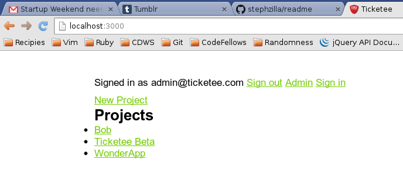

### Ticketee

**Ticketee** is an app created to learn Rails 3 concepts through the text [Rails 4 In Action](http://www.manning.com/bigg2/) early access edition.  Concepts covered TDD, nested resources, authentication, authorization, and file uploading.

## Show Me

Screenshots:

## Project Setup

No special dependencies are known at this time.

### Known Issues

If you discover any bugs, feel free to create an issue on GitHub fork and
send us a pull request.

## Author

This Flavor of the Original By: 
* [Danielle Tucker](www.linkedin.com/in/dqtucker), and 

Original Implemenation By: 
* Ryan Bigg, Yehuda Katz, and Steve Klabnik 

## Contributing

1. Fork it
2. Create your feature branch (`git checkout -b my-new-feature`)
3. Commit your changes (`git commit -am 'Add some feature'`)
4. Push to the branch (`git push origin my-new-feature`)
5. Create new Pull Request

## License

Original code is from [Rails 4 In Action](http://www.manning.com/bigg2/) and no license is provided so it is unclear of the license for use.
